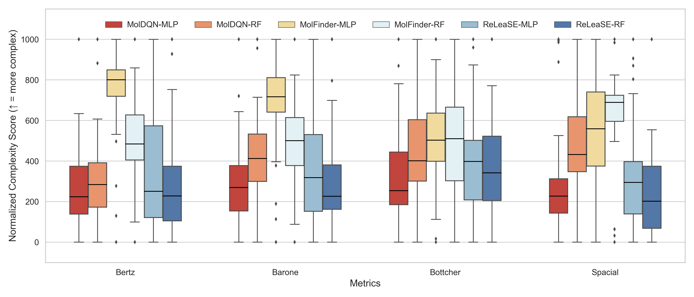

# Fluorophore-design

Design and analysis pipeline for small-molecule fluorophores using cheminformatics and predictive modeling.

---

## Project Overview

This project aims to:
- Curate and preprocess public quantum chemistry data (e.g., PubChemQC)
- Build predictive models for fluorescence-related properties
- Design novel fluorophores with improved characteristics

---

## Repository Structure# Fluorophore-design

