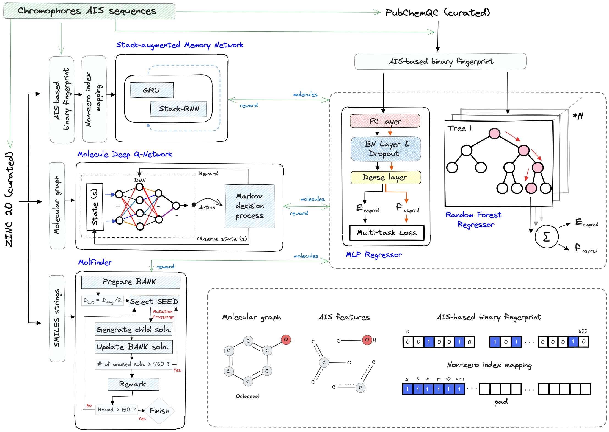
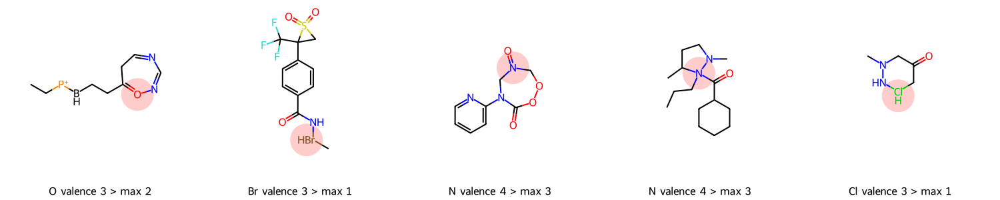
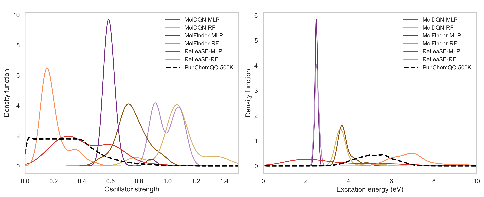
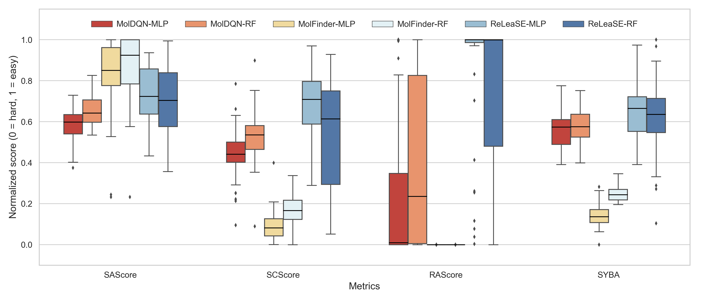

# Fluorophore-design
Deep learning-based de novo molecular design of fluorescent molecules with target photophysical properties.

## Table of Contents
- Description
- project overview
- Dependencies

  
## Description
We present a fluorescence-oriented molecular design strategy that integrates multiple generative models within a chemically constrained and photophysically relevant subspace. Rather than relying on large-scale datasets or model-specific tuning, our approach builds on a curated training set constructed exclusively from atom-in-SMILES (AIS) fragments spanning chromophore-like molecules.The pipeline accommodates reinforcement learning–based ReLeaSE, which employs AIS-based tokenization, MolDQN, which utilizes a graph-based molecular representation, and the combinatorial optimization–based MolFinder, which operates on SMILES strings—each guided by a semi-heuristic objective function targeting excitation energy, oscillator strength, and fluorophore similarity. Despite the compact training corpus, the pipeline yields structurally novel and optically active molecules, validated via QM calculations at the sTDA/CAM-B3LYP level. Our findings demonstrate that strategic data curation and property-driven integration can enable general-purpose models to succeed in specialized discovery tasks such as de novo fluorophore design.

## Project Overview

This project aims to:
- Curate and preprocess public quantum chemistry data (e.g., PubChemQC)
- Build predictive models for fluorescence-related properties
- Design novel fluorophores with improved characteristics

## 

## Repository Structure# Fluorophore-design

